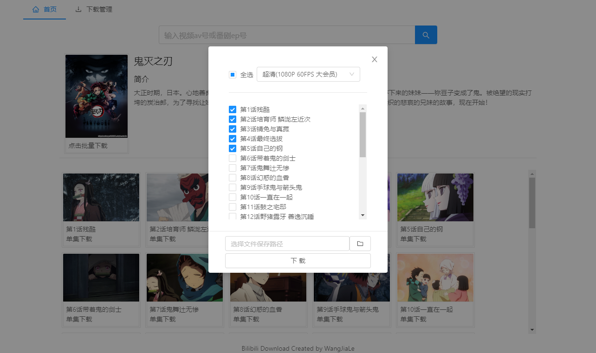

This project was bootstrapped with [Create React App](https://github.com/facebook/create-react-app).

## 声明
###本项目仅供学习使用，请勿挪作商用

## 项目介绍
前端入门半年，主要是想写点东西练手，本项目主要功能是在PC端下载B站视频。项目用到了React，Node及Electron

在项目根目录使用以下命令运行:

`npm i`
`npm start`

##运行环境
请确保安装了NodeJs，我开发时使用的版本是v12.13.0

##操作指引
1、搜索栏输入B站视频AV号或者B站番剧EP号搜索相应视频

2、点击批量下载或者单集下载，选择对应的视频进行下载

3、在下载管理中查看下载进度

##目前存在的缺陷
1、同时下载过多视频会导致视频下载失败，暂时还没有在代码逻辑上限制下载数量只能手动限制，建议同时下载不要超过5个视频（此bug后续随缘更新……）

2、暂不支持断点续传

3、虽然这是个PC端程序，但本质还是B/S架构，在下载进度方面使用了socket.io进行通信，由于通信过于频繁会导致程序卡顿，因此限制了通信次数，下载进度只会10%为一段的向前走（目前暂时没有想到好的解决方案）

4、目前下载管理基本只能查看下载进度，且关闭程序后，以往的记录会消失。类似删除已下载视频，打开所在文件夹等功能还未实现

5、在没有B站账号的cookie的情况下只能下载B站免费的视频，目前是把本人的账号cookie硬编码在程序里（后续可能会增加登录B站账号的功能）

##总结
本项目在下载的核心功能实现上并没有花费太多时间，反而在前后端通信以及react的状态管理上屡屡碰壁。事后细想当时采用B/S的架构太草率了，实施的时候感觉处处绑手绑脚。在编程的过程中还是觉得自己对js还有react了解的太浅了，在js异步这方面踩了不少坑，react的状态管理还有很多不完善的地方。css也是一大弱项，这玩意太难了，调个样式能调几个小时……。深切的感到自己还是太菜了。